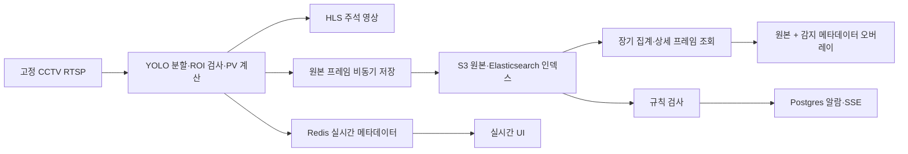

# Flare Stack AI CCTV 조사

이 문서에서 **화면 확인**은 2026-09-29 운영 사이트의 비로그인 세션에서 직접 클릭해 확인한 결과다. **소스 확인**은 로컬 파일에서 읽은 동작이며 운영 배포와 완전히 같다는 뜻은 아니다. 사용자 첨부 캡처 1–10은 UI 세부 표현의 추가 근거다.

## 제작자가 만든 작업 흐름

홈은 여러 CCTV를 빠르게 고르고, CCTV 상세는 실시간 관찰·과거 검증·알람 대응 세 작업으로 나뉜다. 실시간 수치가 이상하면 과거 그래프에서 시간을 고르고, 짧은 구간으로 내려가 원본 프레임과 감지 오버레이를 확인한다. 알람은 별도 규칙과 발생·처리 이력으로 관리한다. 설정과 학습용 저장은 관련 대상 화면 안에 있지만 권한 없는 사람에게는 읽기 또는 비활성 상태로 보인다. 이 구조는 모든 정보를 첫 화면에 늘어놓지 않고 사용자의 판단 단계에 맞춰 깊이를 늘린다.

### 메뉴와 상단

| 요소 | 화면 확인 및 디테일 | 의도와 드론 이식 포인트 |
|---|---|---|
| 좌측 바 | 로고/이름 → 대시보드 홈 → CCTV 목록 → 작은 백엔드 출처 표시. 현재 CCTV는 옅은 청록 바탕·좌측 표식. | 현재 위치와 복귀 경로를 지속 표시. 드론은 홈/점검 계획/사진/조치/라벨 후보 정도로 일차 메뉴를 제한하고 Rack은 그 안에서 선택. |
| 상단 오른쪽 | 달 아이콘으로 다크 모드 전환, 로그인 버튼. 실제 전환과 복귀 확인. | 반복 사용 환경에 맞는 표시 선택. 저장된 사용자의 선호는 새 로그인 설계 때 계정/브라우저 중 하나로 명시. |
| CCTV 제목 | 큰 설비명, 작은 ON 상태, 작게 붙인 ID·Model, 맥락 안의 설정 아이콘. | 식별자와 모델 이력을 가리지 않으면서 제목보다 약하게 표시. 드론은 실제 photo ID와 해당 판독의 model_version을 사용. |
| 모드 탭 | 실시간 뷰 / 과거 이력 / 알람 이력 3개가 둥근 회색 트랙 위에서 하나만 강조. | 대상은 그대로 둔 채 작업 모드만 바꾼다. 드론 사진 상세도 사진/판독/ROI·설명/이력을 구분하되 핵심 요약은 유지. |
| 홈 링크 | 좌측 ‘대시보드 홈’을 누르면 `/`로 돌아감을 확인. | 뒤로 가기와 별도로 확실한 최상위 복귀점. |

홈에서는 ‘전체 활성 채널 12 / 12’, 전체 선택·해제, 활성만 보기, 설비 칩과 카드가 있었다. 모두 해제하자 빈 상태, No.4 CDU 선택 시 카드 하나, 전체 선택 시 12개를 확인했다. 선택은 화면의 표현 상태다. 카드의 ON/LIVE/PV 요약이 상세 진입을 돕는다. 숫자 12와 모델 파일명은 조사 시점의 데이터이며 디자인 상수가 아니다. 카드가 ‘PV -’로 남는 설비도 있으므로 로딩·미연결·결측을 구별해야 한다.

### 실시간 화면

상단 영상과 PV 표시를 중심에 두고 부수 정보는 카드로 배치한다. ‘PV 개요’ 버튼은 계산 원리와 수치 예시를 설명하는 모달을 열었다. 이는 의미를 모르는 지표를 무작정 보게 하지 않으려는 장치다. 소스상 PV는 50을 기준으로 Steam 증가분에서 Flame·Smoke 영향을 차감하고 0–100으로 제한한 뒤 EMA(alpha)로 평활한다. 화면의 40–60 구간을 적정으로 표시한다. CCTV 지표이며 부식 등급에 대응시키면 안 된다.

소스상 영상은 RTSP 입력 → YOLO 분할 마스크 → 신뢰도 및 ROI 필터 → 계산/주석 영상 → MediaMTX/HLS 재생으로 간다. 객체 수치 메타데이터는 Redis에서 query WebSocket으로 흘러간다. `WebRTCPlayer`, `MjpegPlayer` 컴포넌트도 있으나 현재 상세 경로에서 쓰인다고 단정하지 않는다. 옛 Kafka producer 파일이 있어도 현재 compose 기준 실시간 경로를 Kafka라고 부르지 않는다.

### 과거 이력에서 프레임까지

| 단계 | 실제 확인한 동작 | 소스에서 확인한 추가 동작 |
|---|---|---|
| 장기 트렌드 | 기본 1일 범위, 빠른 기간 칩, 직접 시간 입력, 조회 버튼. PV와 Flame·Smoke·Steam 비율이 서로 다른 축과 절제된 범례로 표시. 그래프 한 점을 누르면 선택선이 생기고 아래 세부 그래프 로딩. | 기간에 따라 서버 집계 간격을 5초~1일로 변경하고 500–1000개 수준으로 압축. 결측 버킷은 0으로 채우지 않음. 차트 드래그 범위 선택·범례 표시 전환·더블클릭 확대 복귀 구현. 이 제스처들은 소스 확인이며 이번 화면 조작 검증 대상은 아님. |
| 세부 트렌드 | 선택 전후 짧은 구간의 각 프레임 측정점. 클릭하자 해당 시각의 사진·PV·비율로 연결됨. | 선택점 기준 앞뒤 약 120개씩 최대 240개를 요청하고 저장 프레임이 있는 점만 사용. 선택선과 다른 선 흐리게 처리. |
| 개별 프레임 | 시각, PV, Flame/Steam/Smoke 수치, 원본 이미지, 객체 표시 토글, 확대 버튼, 좌우 화살표, 학습용 저장 버튼. 토글을 켜자 마스크·ROI가 표시되고 끄자 원본으로 돌아감. 확대 후 오른쪽 화살표로 다음 초의 프레임과 수치가 함께 바뀌는 것까지 확인. | 저장 원본에 감지 객체 메타데이터를 SVG로 겹쳐 그리므로 오버레이 변경 때 모델을 다시 돌리지 않음. 확대는 고정 오버레이 모달이고 동일 선택 상태를 공유. 화살표는 로딩된 세부 프레임 목록을 순서대로 이동. 키보드 화살표 지원은 찾지 못함. |
| 학습용 저장 | 버튼은 비로그인 상태에서 비활성. 아이콘과 텍스트가 저장 목적을 보여줌. | 권한 있는 사용자의 POST는 S3 원본을 labeling inbox로 복사하고 기존 항목이면 중복을 표시. 모델이 즉시 재학습되는 기능은 아님. |

장기 그래프와 세부 그래프의 선택 시각이 프레임 카드에도 이어지는 점이 핵심이다. 시각·수치·원본·주석이 따로 놀지 않아 사용자는 그래프의 원인을 확인할 수 있다. 드론에서는 같은 사진 안에서 ‘원본 전체 등급 ↔ 선택 ROI 등급 ↔ 그 판단의 근거’를 연결하는 패턴으로 바꿔야 한다. 드론 사진에 시계열 프레임이나 객체 비율을 꾸며 넣는 것은 근거가 없다.

### 알람 화면

알람 이력 탭에서 규칙 카드 1개(테스트 알람 #2, Flame 비율 0.01 초과, 지속 5초, 활성), 기간 칩·날짜 범위·조회, 정렬/상태 표, 전체/필터 수, 확인 필요·완료 수를 봤다. 비로그인 세션의 새 규칙·편집·삭제는 비활성이고 ‘접근 권한이 없습니다’가 보인다. 행을 열면 규칙·발생 시간·측정값·임계값 구간 그래프·프레임과 확인 메모가 함께 나온다. 확인 처리 버튼도 권한이 없다. 목록의 날짜 기본 범위보다 오래된 미확인 알람이 보인 관찰이 있어, ‘오늘’ 또는 ‘최근’ 같은 라벨은 실제 조회/활성 병합 기준을 명확히 해야 한다.

소스에서는 조건 필드·비교 연산자(gt/gte/lt/lte)·임계값·지속시간·활성을 규칙으로 갖고, 발생 상태에서 같은 규칙의 중복 활성 알람을 억제한다. 이 규칙 방식은 사진 단위 분류에 곧바로 맞지 않는다. 드론 알림을 만든다면 ‘등급 변화’, ‘검수 요청’, ‘보수 재점검 기한’ 등 실재 사건을 정의하고 서버 시간·중복·담당 범위를 새로 설계해야 한다.

### 설정·ROI·권한

No.4 CDU 설정 모달을 열어 PV 계산 파라미터와 감지 대상 ROI 두 탭을 확인했다. 비로그인 상태는 `cctv:manage`가 없다는 안내와 읽기 전용 숫자 필드였다. ROI 탭은 고정 영상에 다각형 꼭짓점 8개가 그려져 있고, 유효 다각형 표시가 있다. 소스상 수정 권한이 있으면 화면 클릭으로 점을 추가하고 끌어 이동하며 직전 점 삭제·초기화 후 저장한다. 정규화 좌표로 저장하고 객체 **바운딩 박스 중심점**이 영역 안인지 검사한다. 감지 객체가 통과하면 전체 프레임 면적 대비 **객체 전체 윤곽 면적**을 비율로 산출한다. ROI 내부로 객체를 잘라 비율을 계산하는 방식이 아니다. 단순 꼭짓점 수 확인 이상의 복잡한 도형 검증을 보장하지 않는다.

로그인 모달은 ID·비밀번호 입력을 제공했다. 계정 정보를 입력하지 않았으므로 관리자 메뉴의 실제 실행 화면은 보지 못했다. 소스상 JWT를 HttpOnly 세션 쿠키로 검증하고 역할·권한·담당 CCTV 범위를 인증 서비스와 각 변경 API가 확인한다. 사용자·역할·권한 관리, 내 프로필/비밀번호 변경, CCTV 설정·알람 규칙·확인 처리·학습용 저장이 관리자 또는 담당 사용자 경로에 있다. 게스트는 조회가 가능하다. 로컬 인증 소스에 `secure=False` 쿠키 설정이 있으나 운영 환경에 그대로 적용됐는지는 확인하지 못했다. 드론 구현 시 HTTPS 쿠키 속성은 별도로 설계·검증해야 한다.

### 시각 언어와 미세 상호작용

| 결정 | 소스/화면에서 본 기준 | 이식 판단 |
|---|---|---|
| 색 | 흰색/연회색 면, 얇은 회색 테두리, 미세한 그림자, 주색 `#009688` 계열. PV 청록, Flame 빨강 `#ef4444`, Steam 파랑 `#3b82f6`, Smoke 회색 `#4b5563`. | 청록은 현재 위치·주요 행동에 쓰고 판독 위험은 별도 의미색으로 표시. 의미 없는 다색 배지 금지. GS 로고/상표의 무단 복제는 계획에 포함하지 않음. |
| 밀도 | 제목은 강하고 ID/Model은 작은 고정폭 레이블, 설명은 작은 회색 문장/도움말. 카드 안 여백이 정보군을 분리. | 드론 사진 번호·등급을 최우선, 원본 해시/전처리/모델 상세는 펼침에 두되 복사 가능한 실제 값은 유지. |
| 동작 | 탭, 스위치, 확대, 화살표, 기간 칩, 의미가 분명한 저장·설정 아이콘. 선택 상태가 색뿐 아니라 체크/텍스트로도 표시. | 드론의 기존 ROI·SHAP 조작도 분명한 말과 상태 설명을 제공. 원본/해설을 언제든 되돌릴 수 있어야 함. |
| 다크 모드 | 상단 토글로 실제 전환 확인. 차트·표면·테두리·문자색이 한 체계로 바뀜. | 카드 일부만 어둡게 만드는 방식은 피하고 이미지 오버레이/그래프/상태색까지 검증. |
| 제한 상태 | 권한 부족 안내와 비활성 조작, 조회 가능 데이터는 유지. | 드론의 권한도 숨김만으로 처리하지 말고 서버에서 강제하고 제한 이유를 설명. |

그대로 답습하지 않을 부분도 확인됐다. 일반 폭(약 1280px)에서 장기 트렌드 제목이나 객체 표시 레이블이 좁아 세로로 말리는 장면이 있었다. 256px 고정 바와 좁은 카드 폭의 조합이다. 프레임 화살표는 작은 아이콘 영역이라 키보드·터치 조작 설명이 부족하다. 소스의 API 실패 후 임시 CCTV/모델을 대입하는 경로와 일부 PV 경고 기준의 단위 불일치는 드론에 옮기지 않아야 할 구현상의 위험이다. 구체적으로 HLS 경고 코드에는 `pv > 0.8` 조건이 있는 반면 다른 PV 표현은 0–100 척도여서 현행 배포 영향은 따로 확인할 문제다.

## 저장과 API 경로

Nginx가 `/api/orchestrator`, `/api/query`, `/api/alarm`, `/api/auth`, `/api/stream` 등을 서비스에 연결한다. 장기 이력은 Elasticsearch에서 서버 측 집계하고, 세부 프레임 이미지는 만료되는 S3 presigned URL(소스 기본 3600초)로 제공한다. 원본 프레임과 탐지/계산 당시 파라미터를 함께 보관한 덕분에 과거 오버레이 해석을 재현할 수 있다. S3·Elasticsearch 90일 보존 설정 파일은 있으나 실제 운영 적용 여부를 증명하지 않는다. 드론 사진 보존 기간에 이를 전용할 이유도 없다.

## 소스 위치

아래는 로컬 폴더 `D:/Application_Temp/flarestack/flare-stack-ai-cctv-backend-main/flare-stack-ai-cctv-backend-main/` 아래 경로다.

| 경로 | 확인한 역할 |
|---|---|
| `frontend/src/app/page.tsx`, `frontend/src/components/dashboard/CctvCard.tsx` | 홈 선택/카드 |
| `frontend/src/app/cctv/[id]/page.tsx` | 실시간·과거·프레임 상태 연결, 확대·저장 |
| `frontend/src/components/streaming/HistoryChart.tsx`, `DetailedHistoryChart.tsx`, `AlarmHistoryPanel.tsx`, `HlsPlayer.tsx` | 차트, 알람, 영상 |
| `frontend/src/components/management/CctvSettingsModal.tsx`, `frontend/src/components/layout/sidebar.tsx`, `topbar.tsx` | ROI·설정, 탐색·테마 |
| `frontend/src/components/layout/login-modal.tsx`, `profile-badge.tsx`, `frontend/src/store/useAuthStore.ts` | 로그인·세션 UI |
| `frontend/src/app/management/users/page.tsx`, `frontend/src/app/management/rbac/page.tsx` | 코드상의 관리자 계정·권한 관리 |
| `frontend/src/lib/api.ts`, `frontend/src/types/index.ts` | API 호출과 데이터형 |
| `model-backend/app/main.py`, `ingest-worker/app/main.py`, `query-service/app/main.py` | 감지/PV, 저장, 과거 조회 |
| `orchestrator/app/main.py`, `alarm-service/app/main.py`, `auth-service/app/main.py` | CCTV/라벨, 규칙·발생·확인, 인증 |
| `docker-compose.yml`, `nginx/nginx.conf`, `mediamtx.yml` | 서비스 구성과 영상 라우팅 |

소스 파일 전체에서 주요 데이터 경로를 추적했지만 모든 CCTV의 영상 품질, 관리자 계정 동작, 운영 인프라의 실제 보존 정책을 확인했다는 뜻은 아니다. 다음 문서의 이식 우선순위는 이 증거 범위를 전제로 한다.
