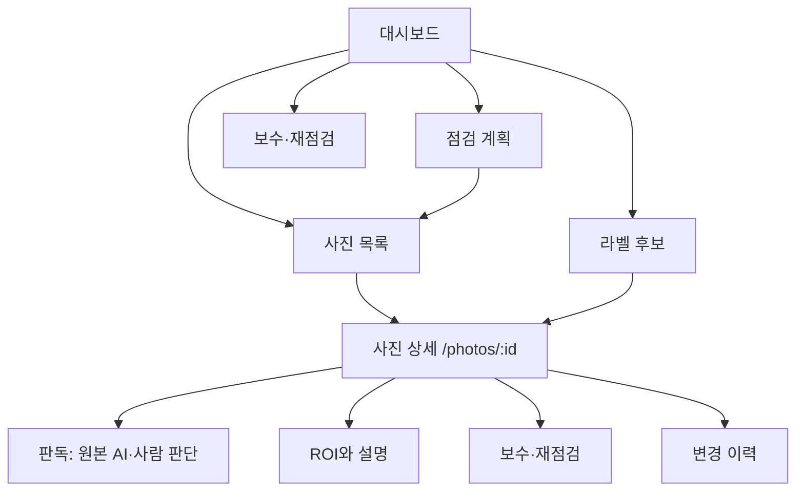

# 드론 점검 플랫폼 이식 설계

대상: [운영 페이지](https://drone-inspection-g10.dlwnsgod2761.workers.dev/)와 [저장소 고정 커밋](https://github.com/junhang-dev/inspection-image-platform/tree/a2c407cc9cd3ccb50fe66e35b0adcdeaeda344a2). 이 문서는 Flare Stack을 복제하는 사양이 아니라, 그 사이트의 명료한 작업 흐름을 드론 점검의 실제 데이터·업무에 맞추는 구현 순서다. 배포 환경이 저장소 커밋과 동일한지는 확인되지 않았다.

## 현재 드론 제품에서 이미 좋은 부분

운영 화면은 계획→사진 업로드→AI 부식 등급→사람 확인→보수 작업→ROI 재판독/SHAP 근거→감사 이력을 갖고 있다. 2026-09-29 화면에서는 사진 362개, 점검점 17개 등이 표시됐으나 이는 당시 데이터다. 사진 목록은 서버 필터·페이지네이션(50개 단위), 업로드는 청크 재개·원본 해시와 중복 처리, 사진 변경은 버전 충돌 및 감사 이력, ROI는 작업 상태·원본/영역/모델 식별 검증을 갖는다. 보수 판단에는 사람 등급 우선, 가시성·자동/수동 포함/제외, 보수 증빙이 있다. 이 계약을 보존해야 한다.

현재 어려움은 정보의 우선순위와 신뢰 표시다. 첫 화면은 큰 시작 안내, 지도, KPI, 반복 버튼이 시선을 나누고, 사진 상세에는 판독·ROI·보수·편집이 동시에 펼쳐져 있다. 사진 제목에 안정적인 ID와 모델 이력이 드러나지 않고, ‘현업 엔지니어’는 실제 로그인 계정이 아니라 화면 기본 문자열/입력값이다. 단일 `src/app/page.tsx`가 2,600줄 넘게 홈·목록·모달·상태를 품고 URL은 사실상 `/` 하나여서 사진 링크 공유, 새로고침, 뒤로 가기 동작을 분명히 하기 어렵다. 지도 점은 실제 설비 좌표가 아니라 식별자 해시로 놓인 개념도(`src/lib/concept-map.ts`)다. 따라서 지도 명칭·범례에 개념 배치임을 써야 한다.

## 제안하는 정보 구조

현재 코드의 일차 메뉴도 이미 대시보드·검사 계획·사진/판독·관리/TA·라벨 후보의 5개다. 이 다섯 목적지는 유지하면서 명칭과 현재 위치 표시를 정돈하고, 장비·Rack·계획 범위는 페이지 상단의 브레드크럼과 필터로 표시한다. 현재 선택 범위는 새 페이지·뒤로 가기에도 유지되도록 URL 쿼리로 나타낸다. 사진 상세는 `/photos/:id?tab=...&from=...`처럼 직접 열 수 있는 경로가 바람직하다. 편집 중 뒤로 가기에는 미저장 변경 안내를 둔다. 첫 홈은 ‘이번에 확인할 것’(미검토, 재촬영, 예정된 보수, 진행 중 작업) → 핵심 수치 → 최근 점검/사진 → 개념 지도 순서가 된다. 지도는 현재의 팀→Rack 탐색을 유지하되 실좌표와 혼동되는 설비 위치 지도처럼 보이지 않게 한다.

## 사진 상세: 첫 이식 대상

사진을 열면 상단에 `Rack 25 · qwerd.JPG`처럼 실제 위치·파일명을 이용한 제목과 상태, 그 아래 `ID: 실제 photo.id`(복사 가능)·`Model: 해당 AI 결과의 model_version` 작은 레이블을 둔다. 현재 등급은 ‘최종 판단 4’, 그 출처는 ‘사람 수정’ 또는 ‘원본 AI’로 함께 쓴다. 모델이 아직 없으면 `미판독`, 실패했으면 `판독 실패`로 표시하고 임시 모델명을 만들지 않는다. 원본 촬영시각이 없다면 업로드시각을 촬영시각으로 부르지 않는다. 팀/설비/Rack/점검계획 관계가 누락됐으면 ‘미연결’로 정확히 표시한다.

데스크톱에서는 왼쪽 큰 이미지와 오른쪽 요약 카드, 모바일에서는 이미지→판독 요약→필요 조치 순으로 쌓는다. 이미지 위의 도구는 `원본 보기`, `ROI 영역`, `SHAP 기여도`를 분리한다. SHAP 빨강/파랑은 등급에 기여한 방향이고 부식 객체를 검출한 윤곽선이 아니라는 설명을 근접 배치한다. ROI는 현재와 같이 사진 일부를 잘라 **별도 등급**을 매긴다. ROI 등급 5와 전체 이미지 등급 4가 동시에 있어도 같은 점수로 섞거나 하나가 다른 하나를 덮어쓰지 않는다. ROI 결과는 원본 해시, ROI ID·버전, 모델/전처리/체크포인트 식별, 실행 시각, 결과·설명 품질을 묶은 별도 카드로 둔다.

사진 크게 보기 버튼은 현재 사진·오버레이 모드·ROI 선택을 그대로 가져가는 대화상자로 만든다. 목록 또는 현재 필터 결과 안에서 좌우 화살표로 이전/다음 사진을 이동하며 시각·등급·관계·판독 정보가 전부 함께 바뀌어야 한다. 키보드 좌우키와 Escape, 터치 가능한 버튼, 현재 `n / 전체`를 넣는다. 목록을 벗어난 사진 링크로 진입했으면 기준 목록을 명시하거나 이동을 숨긴다. 확대 상태에서도 원본/ROI/SHAP 조작이 가능해야 한다. 브라우저 화면이 좁아질 때 레이블이 세로로 깨지지 않게 도구를 두 줄로 배치한다.

기본 탭은 `판독`으로 하고 다음을 순서대로 둔다: 원본 AI 등급과 사람 최종 등급, 판독 시각·모델, 사용자가 다음에 해야 할 조치, 보수 요약. `ROI·설명` 탭에서 현재 ROI 버전, 분석 상태(대기/실행/완료/실패/결과 무효), 전체와 ROI 등급의 차이, SHAP의 품질 상태와 표시 강도를 보여준다. `보수·재점검` 탭은 대상 위치, 상태·방법·TA, 포함/제외 이유, 증빙과 다음 기한을 한 흐름으로 구성한다. `변경 이력`은 누가 언제 무엇을 원값→새값으로 바꿨는지 보여준다. 자주 읽는 요약은 계속 보이고 상세/전처리/원본 해시/감사 로그는 펼침으로 제공한다.

현재 사진 모달의 삭제·복원과 편집 필드가 이미지 바로 옆에서 항상 시선을 끈다. 읽기 상태에서는 주요 행동을 `판독 검토`, `ROI 설정`, `보수 기록`처럼 현재 역할에 맞게 최대 1–2개만 강조하고, 삭제/복원은 ‘더보기’ 아래 둔다. 편집 버튼을 누른 뒤 폼을 열고 저장·취소, 충돌 오류, 변경 사유를 보여준다. 기존 `expectedVersion` 충돌 처리와 soft delete/restore는 보존한다. 저장 성공 직후 사진·목록·카운트를 같은 서버 데이터로 갱신한다.

## Flare 기능별 대응

| Flare Stack 패턴 | 드론에서 실제로 대응할 것 | 구현 경계 |
|---|---|---|
| CCTV ID/Model 태그 | 사진 ID, 원본 AI 모델·전처리 버전, ROI 모델 버전 | 각 결과의 저장값 사용. 현재 실행 모델을 과거 사진에 소급 표시하지 않음. |
| 좌측 CCTV 목록·홈 | 5개 업무 메뉴와 팀/설비/Rack 경로 | 현재 목록·지도 필터 연동은 유지. URL로 복귀 상태 보존. |
| 실시간→과거→알람 3모드 | 사진 판독→ROI·설명→보수·이력 | 실시간 영상 모드 없음. |
| 장기/세부 추세 | 동일 설비·Rack의 점검 회차별 등급 분포 및 사진 비교 | 촬영일/점검일이 신뢰 가능하고 동일 위치 연결이 있을 때만 제공. 1–5 서열 등급을 연속 PV처럼 평활하지 않음. 1회분/결측은 차트 대신 상태 설명. |
| 개별 프레임·객체 표시 | 사진 확대·전체/ROI 영역·SHAP 기여도 독립 표시 | 객체 윤곽은 현재 분류 모델 결과에 없음. SHAP를 ‘객체 검출’로 명명하지 않음. |
| 프레임 저장(클라우드) | 검토된 라벨 후보로 등록하는 명시적 행동 | 현재 라벨 후보 흐름과 맞추고 데이터셋 전송/학습 시작은 별도 승인·상태. 실재 API와 권한 확인 후 노출. |
| 알람 규칙 | 등급 급변, 재촬영/검토 요청, 보수 기한 같은 사건 규칙 | 사진 단위에 ‘5초 지속’ 개념 없음. 알림 설계는 사진/점검 이벤트의 중복·담당·확인 이력 기반. |
| ROI 설정 | 사진별 사각 ROI 버전 편집·재판독 | CCTV 다각형 ROI와 계산 의미가 다름. 기존 정규화 사각형/원본 식별·결과 무효화 계약 유지. |
| 로그인·관리자 수정 | 세션 계정, 역할·담당 팀/Rack, 서버 권한 검사, 행위자 자동 기록 | 현재 자유 입력 ‘현업 엔지니어’를 인증처럼 보여주지 않음. |
| 다크 모드 | 화면 전체 토큰 전환 | 이미지·상태색·차트·SHAP 해석은 동일해야 함. |

## 인증과 행동 권한

현재 외부에 노출된 드론 API의 CORS, 호스트 제한, 비공개 저장 경로는 **사용자별 로그인·권한**과 다르다. ‘현업 엔지니어’ 입력을 신원으로 사용할 수 없으므로 설계상 다음 역할을 제안한다. 역할 이름은 도입 시 현업 용어로 조정 가능하다.

| 행동 | 조회자 | 점검 담당 | 검토자 | 관리자 |
|---|---:|---:|---:|---:|
| 허용된 범위의 사진·계획·이력 조회 | ○ | ○ | ○ | ○ |
| 담당 범위의 업로드·관계 수정·ROI 작업 | — | ○ | ○ | ○ |
| AI 등급의 사람 수정·검토 완료 | — | — | ○ | ○ |
| 보수 판단·증빙·확인 | — | 배정된 작업 | ○ | ○ |
| 사용자·권한·규칙 관리 | — | — | — | ○ |

모든 변경 API에서 서버가 세션과 팀/Rack/계획 범위를 확인하고, UI는 동일 권한에 따라 버튼을 숨기거나 비활성 이유를 알려준다. 기존 공개 조회 범위는 서비스 정책으로 명시하고 비공개 사진을 로그인만으로 전체 공개하지 않는다. 변경자 ID는 서버 세션에서 기록하며 이전 자유 입력 이력은 ‘기존 입력’으로 보존한다. 세션은 HttpOnly·Secure·SameSite 쿠키, 만료/로그아웃/CSRF 정책과 HTTPS 배포 경로를 함께 설계한다. 권한 도입 전 기존 API 클라이언트와 업로드 재개 동작에 미치는 영향도 확인한다.

## 디자인 시스템 초안

GS 로고는 사용하지 않는다. 드론 제품 고유 로고·제품명을 간결하게 만들고 Flare의 공간·색 사용 원칙만 참고한다. 표면은 `#ffffff`, 페이지 바탕은 연한 중성 회색, 주요 행동은 청록 계열(기존 녹색과 호환되도록 실제 화면에서 대비 검사), 본문 진한 청회색, 보조 글자 중간 회색으로 정한다. 색 토큰은 `surface`, `surface-muted`, `text`, `text-muted`, `border`, `accent`, `accent-hover`, `danger`, `warning`, `success`와 다크 변형으로 중앙화한다. AI 등급 배지는 1–5의 동일한 의미색을 모든 화면에 적용하고 사람 수정은 색만이 아닌 ‘사람 수정’ 문구/아이콘으로 구분한다. 보수 상태색은 등급색과 충돌하지 않게 별도 아이콘과 텍스트를 둔다.

사이드바 약 240–256px, 상단 헤더 약 64px, 기본 카드 모서리 10–14px와 얇은 테두리, 작은 그림자, 16–24px 간격을 출발점으로 삼되 좁은 화면에선 접히는 메뉴와 2열→1열 전환을 우선한다. 사진 상세 제목은 크고, ID/Model은 12–13px의 고정폭 레이블. 버튼은 아이콘 단독보다 동사와 함께 표시하고 클릭 영역은 최소 40–44px로 잡는다. 스켈레톤/빈 상태/오류/오래된 자료를 구분하며 임시 모델·가짜 정상값으로 덮지 않는다. ‘저장’이나 클라우드 아이콘은 어떤 자료를 어디에 보낼지 설명하고 실제 권한에만 활성화한다.

## 구현 순서와 완료 기준

| 순서 | 작업 묶음·주 파일 | 먼저 끝났다고 볼 조건 |
|---|---|---|
| P0 데이터/상태 계약 | `src/lib/api.ts`, `src/lib/photo-query.ts`, `server/photo-query.mjs`, `server/index.mjs`; 사진·ROI·보수의 현재/원본/사람 값 필드 사전 작성 | 같은 사진의 전체 AI·최종·ROI 값과 각각의 모델·원본·버전이 API→UI에서 1:1로 맞음. 미판독·실패·삭제·오래된 결과가 분리됨. 현재 서버 필터/50개 페이지/충돌 처리 유지. |
| P1 공통 껍질·탐색 | `src/app/page.tsx` 분리, `src/app/globals.css`, 기존 5개 메뉴 정리와 layout/sidebar/header, URL 라우트 | 홈/계획/사진/작업/라벨 후보를 직접 URL로 열고 새로고침·뒤로 가기·복귀 시 범위와 페이지가 유지. 모바일에 메뉴 접힘. 데이터 없는 상태도 의미가 분명함. |
| P1 사진 상세 재설계 | 현재 `PhotoDialog` 구간을 독립 컴포넌트/경로로, `src/components/RoiPanel.tsx`와 보수 패널 재사용 | ID/모델·최종 등급 출처·원본을 처음 1화면에서 확인. 확대·이전/다음·키보드·원본/ROI/SHAP가 서로 동기화. 수정은 별도 모드. |
| P2 로그인·권한 | 새 세션/역할 저장소·미들웨어, 변경 API별 범위 검사, 화면 권한 안내 | 조회자에게 수정 불가, 담당자는 자기 범위만, 관리자만 계정·규칙 관리. 직접 API 호출도 403. 감사 로그의 actor는 세션값. 로그아웃/만료 후 변경 불가. |
| P2 계획/작업 요약 | 기존 `MaintenancePanel`·`InspectionMap`·계획 화면 | 중복 CTA 축소, 설비/계획 문맥 표시, 보수 판단·증빙·가시성 규칙 보존. 지도에 ‘개념 배치’ 문구와 위치 미확인 표시. |
| P3 비교·알림·테마 | 회차별 동일 대상 비교 API, 사건 규칙/알림, theme 토큰 | 실제 동일 Rack/설비의 두 회차 이상일 때만 변화 표시. 누락 시각은 누락으로 둠. 알림 중복 억제·확인 로그. 밝음/어두움 모두 표·모달·이미지 설명의 대비 검증. |

P0/P1 화면 작업은 기존 판독·업로드·보수 기능을 계속 쓸 수 있는 작은 변경 단위로 진행한다. `src/app/page.tsx`의 큰 상태를 한 번에 재작성하지 않고 목록/상세/계획/작업 경계를 먼저 뽑는다. API 계약을 기록한 뒤 인터페이스만 이동하고, 각 단계에서 기존 핵심 흐름을 회귀 검사한다. 관리자 기능은 화면 숨김보다 서버 권한부터 구현한다. 팀/Rack 소유 규칙과 공개 조회 정책은 실제 사용자 운영 방식에 맞춰 결정해야 하며, 결정 전에는 현재 공개 범위를 무심코 넓히지 않는다.

## 통과 시나리오

1. 홈에서 팀·Rack을 골라 사진 목록으로 이동하고 새로고침·뒤로 가기를 반복해도 범위·필터·전체 건수·현재 페이지가 유지된다.
2. 사진 한 장을 열면 실제 ID, 원본 AI 등급/모델, 최종 등급과 출처, 업로드·판독 시각의 구분을 볼 수 있다. 값이 없는 필드는 비어 있음을 정확히 설명한다.
3. ROI v1/v2를 바꾸면 선택 사각형과 ROI 결과/모델/버전이 맞게 바뀌고 전체 이미지 등급은 변하지 않는다. 오래된 비동기 응답과 원본 변경 뒤 결과는 현재값처럼 보이지 않는다.
4. 확대에서 다음/이전·키보드 키를 누르면 사진·등급·메타데이터·오버레이가 동시에 전환되고 목록 끝에서 범위를 벗어나지 않는다. 작은 화면에서도 조작할 수 있다.
5. SHAP를 켜고 끌 때 원본이 보존되고 ‘부식 영역 검출’로 오해할 표현이 없으며 품질이 기준을 벗어나면 설명을 정상 결과로 표시하지 않는다.
6. 권한 없는 사용자는 편집·업로드·보수 처리·라벨 등록이 서버에서도 거절된다. 권한 있는 수정은 actor/이유/전후값을 남기고 버전 충돌 시 덮어쓰지 않는다.
7. 기존 사진 업로드 청크 재개, 사진 soft delete/restore, 보수 자동/수동 포함/제외, 상태별 목록 집계가 UI 변경 후에도 그대로 동작한다.
8. 실패한 API 호출은 빈 결과와 구별된 오류·재시도 상태가 되고, 로딩 중 지난 필터의 사진이 현재 범위의 결과처럼 보이지 않는다.
