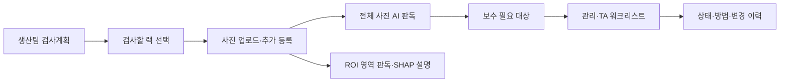
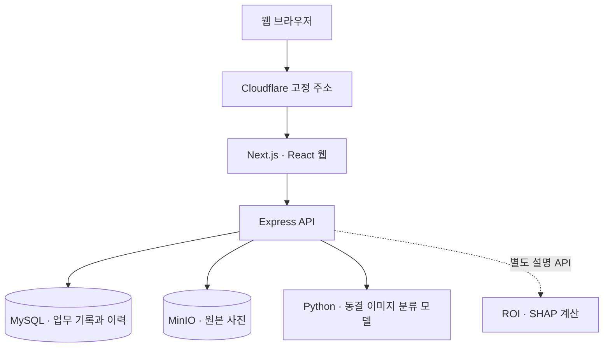

# Drone Inspection Platform

**생산팀의 검사계획부터 사진 판독, 보수·TA 업무와 변경 이력까지 연결하는 검사·보수 통합 관제입니다.**

| 제출물 | 링크 |
|---|---|
| 서비스 | [Drone Inspection Platform 열기](https://drone-inspection-g10.dlwnsgod2761.workers.dev) |
| 소스 코드 | [GitHub 저장소](https://github.com/junhang-dev/inspection-image-platform) |

**제출물은 위 서비스 URL과 GitHub 저장소 두 개입니다.**
계획·업로드·자동 보수 흐름은 실제 화면과 백엔드 파일로 검증했습니다. 현재 고정 주소의 최신 v3 전환과 승인된 업무 데이터 이관을 마무리하고 있습니다. 최종 반영 상태는 [v3 진행 현황](records/2026-09-22-product-v3-status.md)에 기록합니다.


## 어떤 문제를 해결하나요?

검사 사진이 폴더에만 쌓이면 어느 계획과 구역의 사진인지, 무엇을 다시 확인해야 하는지 추적하기 어렵습니다.
이 프로젝트는 사진을 생산팀·파이프랙·검사계획에 연결하고 실제 AI 결과와 후속 업무를 같은 기록에서 이어갑니다.
AI의 원래 결과와 사람 수정값을 분리하고, 파일과 변경 이력을 보존해 나중에 같은 근거를 다시 조회할 수 있게 합니다.



사진·계획·보수 업무는 같은 식별자로 연결됩니다. AI는 판독 근거를 제공하며, 작업 방법과 완료 여부는 사용자가 기록합니다.

## 사용 흐름과 주요 기능

1. **검사계획 만들기:** 생산팀과 검사할 랙을 선택합니다. 개별 검사 포인트 등록은 선행 조건이 아닙니다.
2. **사진 추가:** 계획과 랙을 지정해 사진을 올립니다. 같은 계획에 여러 차수로 사진을 추가하는 흐름을 제공합니다.
3. **판독 확인:** 전체 사진의 AI 등급을 확인하고, 필요한 영역은 ROI로 지정해 별도 판독·설명을 요청합니다.
4. **후속 업무:** 보수 필요 대상을 관리·TA 워크리스트에서 확인하고 상태·방법·TA 여부를 구분해 관리합니다.
5. **수정과 이력:** 계획·사진·보수 업무를 수정하거나 복구 가능하게 숨기고, 접힌 이력을 펼쳐 변경 내용을 확인합니다.


| 기능 | 제공 내용 | 확인한 범위 |
|---|---|---|
| 생산팀·랙 계획 | 팀 선택, 다중 랙 선택, 계획 수정·완료·취소·재개 | v3 후보 A에서 실제 선택·저장·상태 전환 PASS |
| 가상 구역 지도 | 정유 1~4팀, 팀별 30랙, 기존 위치 관계 보존 | 120랙 카탈로그·기존 12랙 필드 보존 정적 확인 |
| 추가 업로드 | 파일별 청크 전송, 부분 실패 복구, 같은 전송 ID로 재시도 | v3 실제 두 차수 업로드·원본 SHA 확인, 중복 요청·종료 경합 복구 PASS |
| 사진·KPI 조회 | 같은 조회 조건의 목록·전체 건수·판독 상태 확인 | v3 후보 A의 팀·랙 조회·사진 숨김 경로 확인 |
| 자동 보수 업무 | 유효 3~5등급 자동 대상, 상태·방법·TA·수동 제외 분리 | 실제 자동 포함·등급 변경·수동 제외·기존 상태 보존 PASS |
| ROI·SHAP | 영역별 판독, 실제 모델의 양·음 기여도와 대상 등급 | 실제 계산·저장 결과 표시 확인, 후보 B의 독립 UI 회귀 진행 중 |
| 수정·삭제·복원 | 원본과 이력을 보존하는 숨김·복원, 수정 충돌 감지 | v3 계획·보수·사진 경로와 변경 충돌·이력 보존 확인 |

보수 필요 여부는 사람 수정 등급이 있으면 그 값, 없으면 원래 AI 등급을 사용합니다.
ROI 결과는 전체 사진 결과와 별도로 보존하며, ROI 등급만으로 기존 보수 상태나 작업 방법을 자동 확정하지 않습니다.

## 구성



브라우저는 제품 웹의 API 경로를 사용하고, 원본 저장·업무 기록·AI 계산은 서버에서 처리합니다.
Cloudflare Worker → 전용 Tunnel → 서버 웹으로 연결합니다. 주소가 고정되어도 서버·저장소·모델·연결 프로세스는 실행 중이어야 합니다.

| 구성 요소 | 역할 | 주요 위치 |
|---|---|---|
| Next.js 16 · React 19 · TypeScript | 대시보드, 계획, 사진, 보수 화면 | `src/` |
| Express 5 | 업로드 세션, 조회, 업무 수정, 모델 연결 | `server/` |
| MySQL 8.4 | 사진 메타데이터, 관계, 상태, 변경 이력 | `compose.yaml` |
| MinIO | 재인코딩하지 않은 원본 객체 보관 | `compose.yaml` |
| Python 모델 | 전체 사진의 시각적 부식 1~5등급 분류 | `ml/` |
| SHAP GradientExplainer | 지정된 전체 사진/ROI의 모델 기여도 계산 | `ml/ROI_SHAP_API.md` |
| Docker Compose | 저장소 및 선택적인 웹·API·모델 실행 | `compose.yaml`, `compose.model.yaml` |

## 로컬에서 실행하기

Node.js·npm, Docker Compose, 모델용 Python 환경이 필요합니다.
제품 코드와 `ml/`가 함께 있는 최종 통합 커밋을 사용하세요.
원본 데이터·DB·가중치·비밀 설정은 Git에 없으므로 저장소 복제만으로 제출 사이트의 데이터와 모델이 준비되지는 않습니다.

```sh
git clone https://github.com/junhang-dev/inspection-image-platform.git
cd inspection-image-platform
npm ci
npm run setup
```

`setup`은 로컬 비밀 설정을 준비합니다. 실행 전에 저장소 범위·데이터 정책·모델 연결을 별도로 설정해야 합니다.
데이터 정책의 `DATA_SCOPE`, `DATASET_PLAN_PATH`, `DATASET_PLAN_SHA256`과 모델 연결을 실제 인계 자료에 맞춥니다.
이 경로와 자격은 로컬 `.env`에서 관리하며 README나 Git에 기록하지 않습니다.
새 업무 상태·ROI 설정·전환 조건은 [v3 실행 계약](docs/product-v3-runtime.md), 데이터 설정은 [원본 연결 안내](docs/private-import.md), 모델은 [동결 모델 운영 안내](ml/OPERATIONS.md)를 확인하세요.

```sh
npm run infra:up
npm run build
```

다른 터미널에서 API와 웹을 각각 실행합니다.

```sh
npm run start:api
```

```sh
npm start
```

| 로컬 확인 경로 | 용도 |
|---|---|
| `http://127.0.0.1:3000` | 제품 웹 |
| `http://127.0.0.1:4000/api/health` | API·저장소·모델 연결 상태 |
| `http://127.0.0.1:8001/health` | 별도로 준비한 동결 모델 상태 |

모델까지 컨테이너로 실행하려면 동결 가중치·계약의 읽기 전용 경로를 설정한 뒤 `npm run stack:model:up`을 사용합니다.
이 명령은 `compose.yaml`과 `compose.model.yaml`을 결합합니다. ROI·SHAP 설명 서비스는 별도 설정이 필요합니다.
설명 서비스의 입력·좌표·모델 계약과 실행 방법은 [ROI·SHAP API 안내](ml/ROI_SHAP_API.md)에 있습니다.
새 버전의 실행·업무 상태는 [v3 실행 계약](docs/product-v3-runtime.md)을 따릅니다. 이전 실행 기록은 재현 근거로 보존합니다.


## 실제 검증과 한계

검증은 화면 표시뿐 아니라 같은 사진 ID, API 결과, 저장 파일의 크기·SHA-256, 변경 이력을 대조했습니다.
각 항목은 아래에 명시한 버전과 환경에서 확인한 결과입니다.

| 항목 | 확인한 결과 | 범위 |
|---|---|---|
| 원본 업로드·복구 | 13개 입력 및 20MB 초과 유효 이미지의 저장·재조회, 부분 실패·응답 손실 복구 | v2 격리 환경 |
| 10장 처리 | 저장 확인 8.815초, 이후 전체 AI 결과 표시 6.237초 | 승인 사진의 동일 바이트 복제 10개, 자동 관측 1회 |
| 실패 후 재판독 | 화면 버튼 1회 → 같은 사진 ID의 실제 AI 완료, 실패 이력 보존 | v2 별도 오류 주입 환경 |
| 원본 300장 | 사진 기록 300개·고유 객체 299개·483,481,091바이트 전수 SHA 대조 | v3 후보 복제·4개 서비스 재시작 후 보존; 공개 이관 중 |
| ROI·실제 SHAP | 정상 요청 200, 잘못된 ROI·해시 불일치 422, 기여합 재계산 일치 | v3 모델 API; 최종 UI 검증 별도 |
| v3 핵심 업무 | 포인트 없는 계획·추가 업로드·자동 보수·수정·복원·충돌·이력 | 후보 A 실제 UI/API/파일 검증 PASS |
| 고정 주소 | 청크 업로드·같은 ID 재시도·실제 AI·원본 SHA·이력, 연결 재시작 뒤 같은 URL | 기존 서비스 연결 PASS; 최신 v3 전환 중 |

10장 저장 확인 시 이미 일부 AI 판독이 끝났으므로 6.237초는 10장 전체의 순수 모델 계산 시간이 아닙니다.
과거 1장 흐름의 2.672초는 AI만 기다린 시간을 뺀 에이전트 자동 조작 관측입니다.
사람의 판단·OS 파일 찾기 시간을 포함한 전체 업무 1분 달성을 입증한 수치가 아닙니다.

현재 동결 모델은 **train 99.57%로 목표 90% PASS, 고정 test 60%로 목표 70% FAIL**입니다.
추가 후보 2개를 각 4epoch 비교했으나 validation 56.90%·51.72%로 기존 63.79%보다 낮아 선정하지 않았습니다.
기존 모델·평가 기록을 유지하며, 기능 연결이나 SHAP 설명 성공을 정확도 향상으로 표현하지 않습니다.
상세 결과: [기존 모델 평가](records/model-final-evaluation.md), [ROI·SHAP와 후보 비교](records/model-v3-roi-shap.md).

## 데이터·운영 범위

- 사용자가 승인한 원본 300장과 기존 업무 기록을 최종 사이트에 연결합니다. 검증·평가용 fixture는 일반 업무 목록에서 분리하고 기록은 보존합니다.
- 원본 파일·DB·분리 목록·가중치·비밀·로컬 검증 자료는 Git에 포함하지 않습니다. 새 업로드를 자동 학습 자료로 편입하지 않습니다.
- 정유 4팀×30랙은 **가상 카탈로그**입니다. 기존 12랙 좌표를 보존했고 추가 108랙의 좌표는 미정입니다.
- 지도는 AI 보강 시각 참고이며 실제 측량·설비 위치 확인·드론 자동 비행을 구현한 결과가 아닙니다.
- 등급과 SHAP은 사진에 대한 모델 결과입니다. 실측 두께·잔여 수명·물리적 부식 원인·설비 안전성·최종 보수 지시를 보증하지 않습니다.
- JPG·PNG를 파일별로 전송하며 임의의 10장·20MB 제한은 제거했습니다. 디스크·네트워크·이미지 디코더의 자원 보호는 유지합니다.
- 삭제는 복구 가능한 숨김입니다. 이미 조회자가 내려받은 원본까지 회수하는 기능은 아닙니다.
- 현 버전의 수정자 표기는 계정 인증된 신원이 아닙니다. 제출 사이트의 공개 범위에 맞는 사진과 업무 기록을 사용합니다.
- 고정 URL도 원본 서버·저장소·모델·연결 프로세스가 실행 중이어야 동작합니다. 상시 가용성 보장을 뜻하지 않습니다.

## 문서와 협업

| 문서 | 내용 |
|---|---|
| [v3 목표·데이터 계약](docs/product-v3.md) | 최신 요구 W01~W16과 완료 기준 |
| [v3 진행 현황](records/2026-09-22-product-v3-status.md) | 구현·검증·미완료 상태 |
| [v3 실행 계약](docs/product-v3-runtime.md) | 현재 상태 규칙·모델 연결·실행·전환 |
| [독립 검증](docs/validation-v3-contract.md) | 실제 UI·파일·업무 관계의 검증 범위 |
| [배포 안내](docs/deployment-v3.md) | 고정 주소·전환·복구 조건 |
| [ROI·SHAP API](ml/ROI_SHAP_API.md) | 좌표·모델·기여도·실패 상태 |
| [이전 버전 인수](records/2026-09-22-completion-handoff.md) | v2 실행 결과와 당시 한계 |

제품·모델·QA·배포 작업을 분리하고 작업 브랜치와 PR로 검토합니다. 실행하지 않은 검사는 완료로 표시하지 않습니다.
로컬 기본 검사는 `npm run typecheck`, `npm test`, `npm run build`이며 실제 서비스·브라우저 검증은 별도 기록합니다.
`package.json`의 라이선스 표기는 `UNLICENSED`입니다. 공개 저장소를 별도 오픈소스 라이선스 부여로 해석하지 않습니다.
